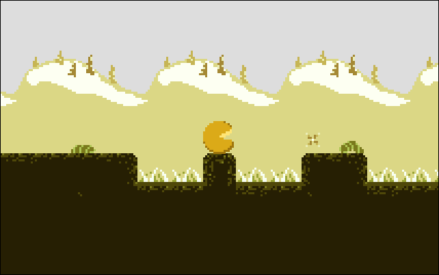

# You Are The Münster

You are the münster, but not a monster.  Not yet, at least...

A game made during the [Ludum Dare 33 Jam][].  [Try it!][].

By [merwaaan][] and myself, with input and support from [Marie-Donnie][].

## Controls

<kbd>←</kbd>/<kbd>→</kbd> arrow keys to move.
<kbd>Space</kbd> to jump.

## Tools used

- [Aseprite][] for graphics
- [Sunvox][] for the background music
- [Sfxr][] for sound effects
- [Tiled][] for placing tiles and objects

[Ludum Dare 33 Jam]: http://ludumdare.com/compo/ludum-dare-33/?action=preview&uid=58042
[Try it!]: http://0xc0de.fr/yatm/
[Aseprite]: http://www.aseprite.org/
[Sunvox]: http://www.warmplace.ru/soft/sunvox/
[Sfxr]: http://www.drpetter.se/project_sfxr.html
[Tiled]: http://www.mapeditor.org/
[merwaaan]: https://github.com/merwaaan
[Marie-Donnie]: https://github.com/Marie-Donnie
